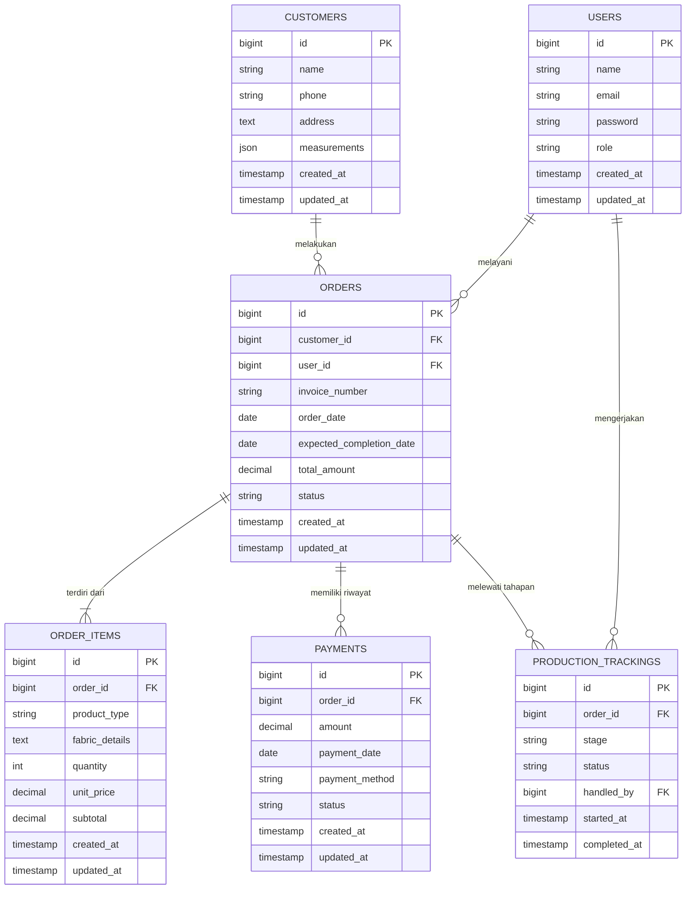

# Product Requirements Document (PRD)
**Nama Produk:** Sistem Manajemen Jasa Produksi Tailor  
**Versi Dokumen:** 1.0  
**Tanggal:** 7 Juli 2026  
**Penulis:** Senior Product Manager & Tech Lead  

---

## 1. Pendahuluan (Introduction)

### 1.1 Latar Belakang
Usaha tailor (penjahit) seringkali menghadapi tantangan dalam melacak pesanan pelanggan, ukuran pakaian yang bervariasi, status produksi yang berlapis (mulai dari pemotongan kain hingga finishing), serta pengelolaan pencatatan pembayaran (Down Payment dan Pelunasan). Oleh karena itu, diperlukan sistem informasi yang terintegrasi untuk mengotomatisasi dan memonitor alur kerja produksi tersebut.

### 1.2 Tujuan Produk
Membangun aplikasi web berbasis Laravel untuk mendigitalisasi proses bisnis penjahitan/tailor yang meliputi:
- Pencatatan data pelanggan beserta spesifikasi ukuran secara detail.
- Manajemen pesanan (order) dan pembayaran.
- Pelacakan progres produksi pakaian secara real-time.
- Pembuatan laporan pendapatan dan produktivitas pegawai.

### 1.3 Target Pengguna
- **Superadmin / Pemilik Usaha:** Mengelola seluruh akses pengguna, laporan keuangan, dan memantau keseluruhan bisnis.
- **Admin / Kasir:** Melayani pelanggan, memasukkan data pesanan baru, ukuran badan pelanggan, serta memproses pembayaran.
- **Pegawai / Penjahit:** Memperbarui status produksi yang menjadi tanggung jawabnya (misalnya: status pemotongan, penjahitan, atau penyelesaian).

---

## 2. Ruang Lingkup Fitur (Feature Scope)

1. **Manajemen Autentikasi & Otorisasi Pengguna**
   - Login, Logout, dan manajemen peran (Role-based access control: Superadmin, Admin, Pegawai).

2. **Manajemen Pelanggan (Customer Management)**
   - CRUD data pelanggan (Nama, No HP, Alamat).
   - Penyimpanan parameter ukuran badan spesifik (Panjang lengan, Lingkar dada, Lingkar pinggang, dll) yang dapat dinamis menggunakan format JSON.

3. **Manajemen Pesanan (Order Management)**
   - Pembuatan pesanan dengan *invoice number* otomatis.
   - Pendaftaran item pakaian yang akan dijahit dalam satu pesanan (misal: 1 Kemeja, 2 Celana Panjang).
   - Penentuan tanggal estimasi selesai (deadline).

4. **Pelacakan Produksi (Production Tracking)**
   - Fitur Kanban atau daftar tahapan produksi.
   - Status tahapan meliputi: *Pending*, *Pemotongan (Cutting)*, *Penjahitan (Sewing)*, *Finishing*, dan *Siap Diambil*.

5. **Manajemen Pembayaran (Payment & Invoicing)**
   - Pencatatan pembayaran Bertahap (DP / *Down Payment*) dan Pelunasan.
   - Cetak nota tagihan (Invoice) untuk pelanggan.

6. **Dashboard & Laporan (Reporting)**
   - Ringkasan jumlah pesanan aktif, pesanan selesai, dan pendapatan bulanan.

---

## 3. Arsitektur Sistem & Skema Data

### 3.1 Penjelasan Naratif
Sistem ini dibangun menggunakan kerangka kerja (framework) **Laravel 11** dengan pendekatan **MVC (Model-View-Controller)**. Basis data yang digunakan adalah **SQLite** (dapat diskalakan ke MySQL untuk produksi). Antarmuka pengguna (UI) menggunakan template **Bootstrap NiceAdmin**.

**Skema Basis Data utama terdiri dari entitas berikut:**
1. **Users (`users`)**: Menyimpan data kredensial pegawai dan admin. Tabel ini memiliki kolom `role` untuk membedakan hak akses.
2. **Customers (`customers`)**: Menyimpan identitas pelanggan. Karena ukuran badan bisa bervariasi antar pelanggan dan jenis pakaian, atribut ukuran disimpan dalam format JSON pada kolom `measurements` untuk fleksibilitas.
3. **Orders (`orders`)**: Tabel induk untuk transaksi pesanan. Terhubung dengan `customers` dan `users` (admin yang melayani). Berisi total tagihan, tanggal pesanan, dan tanggal target selesai.
4. **Order Items (`order_items`)**: Tabel detail dari pesanan. Satu pesanan dapat memiliki banyak pakaian. Menyimpan jenis pakaian, detail kain, kuantitas, dan harga satuan.
5. **Payments (`payments`)**: Melacak riwayat pembayaran dari sebuah pesanan. Satu pesanan bisa dicicil (DP dan Pelunasan).
6. **Production Trackings (`production_trackings`)**: Tabel log tahapan produksi. Setiap kali status pakaian berpindah (misal: dari pemotongan ke penjahitan), log akan dicatat beserta penjahit (`handled_by`) yang mengerjakannya dan timestamp-nya.

### 3.2 Visualisasi ERD (Entity Relationship Diagram)

---

## 4. Rencana Implementasi & Tech Stack

- **Backend:** PHP 8.x, Laravel 11.x
- **Frontend:** HTML5, CSS3, JavaScript (Vanilla/jQuery), Bootstrap 5 (NiceAdmin Template)
- **Database:** SQLite (Development) / MySQL (Production)
- **Deployment:** VPS / Shared Hosting dengan akses SSH.
- **Version Control:** Git & GitHub.

## 5. Kriteria Penerimaan (Acceptance Criteria)
1. Admin harus dapat memasukkan ukuran pelanggan secara spesifik dan tidak hilang saat pesanan baru dibuat oleh pelanggan yang sama.
2. Status produksi harus bisa di-update oleh Pegawai/Penjahit yang ditugaskan, dan perubahan status tersebut terekam dalam tabel `production_trackings`.
3. Sistem mencegah penghapusan data master jika ada data transaksi yang bergantung (Relational Integrity constraint).
4. Pembuatan faktur (Invoice) dapat dicetak dengan rapi dan menunjukkan riwayat pembayaran.
